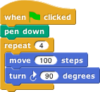

# Getting Started

Snap_!_ is a programming language, which you can use to tell a computer what to do. A **program** is a particular set of instructions for the computer to follow.

Programs in most languages are text-based, but Snap_!_ is different: it's a visual language. Instead of writing a program only using the keyboard, you will drag pictures of blocks and click them together.

The following is a program in Snap_!_:

Can you guess what it might do?

Snap_!_ is different that many other languages in another way— you run it in a web browser like Firefox or Chrome. At this time, we recommend you use the [Chrome browser](http://www.google.com/chrome/). The URL that you can use to always get to _Snap!_ is:

[**http://snap.berkeley.edu/run**](http://snap.berkeley.edu/run)

In order to save your programs, the first thing you'll need to do is make an account. In the Snap_!_ browser window, find the cloud-shaped button in the top toolbar on the upper left corner of the window:

Click it, select the "sign up" option in the menu, and follow the instructions there. You will need to check your email after creating your account to get your initial password.

